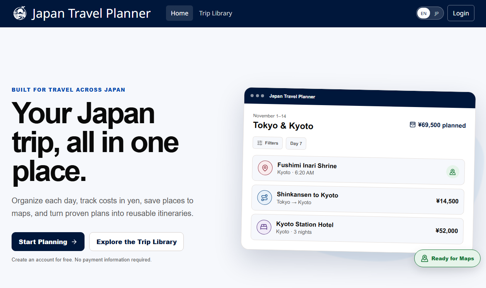
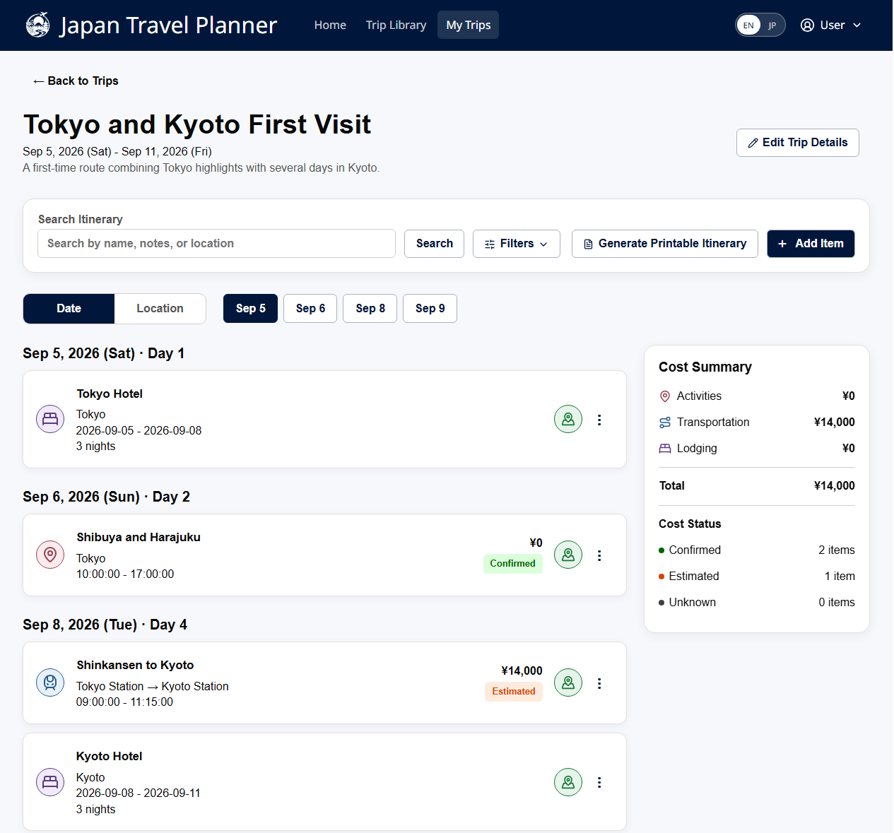
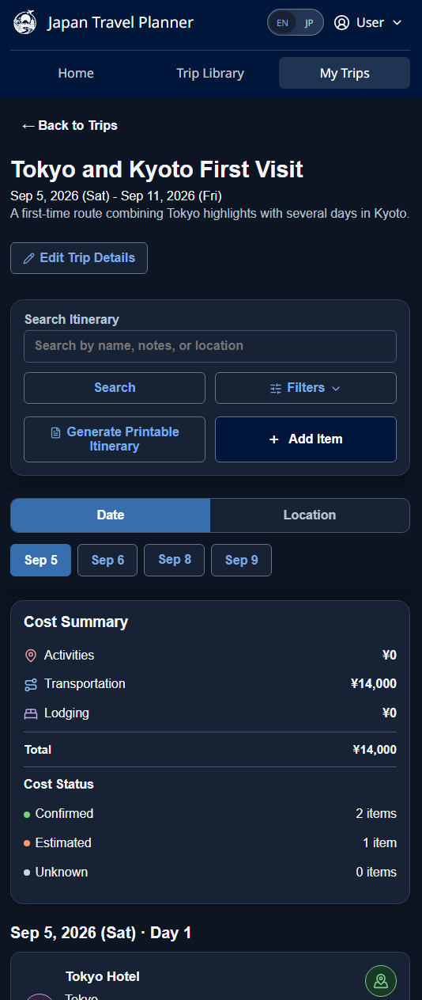
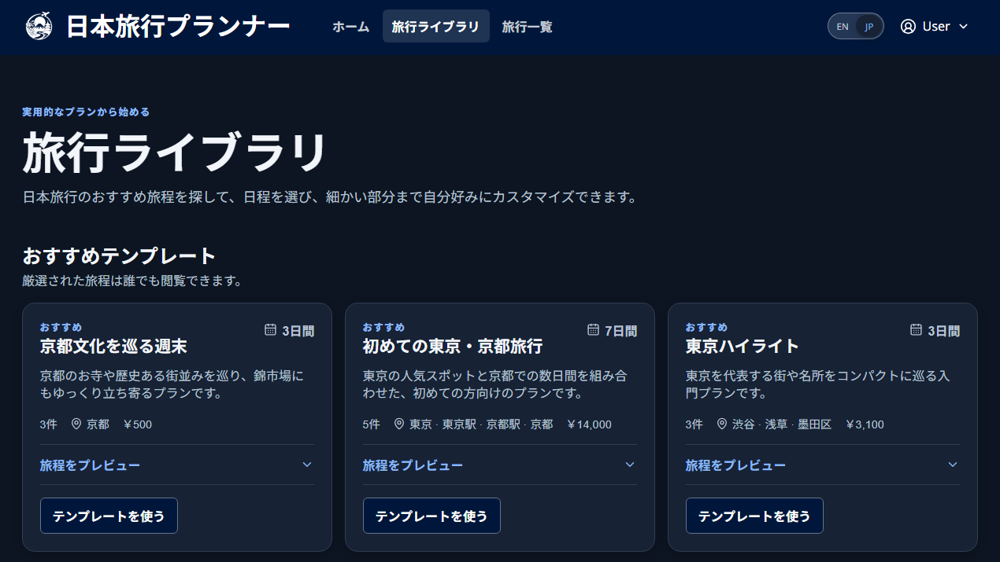

# Japan Travel Planner

[](https://github.com/TapiaTyler/japan-travel-planner/actions/workflows/ci.yml)

**[View the live application](https://japan-travel-planner-production.up.railway.app/)**

A full-stack itinerary planner designed for travel within Japan. Users can organize trips, filter scheduled items, track costs in Japanese yen, reuse templates, open destinations in their preferred map application, and generate printable itineraries. The interface is responsive, supports English and Japanese, and includes light and dark themes.

This project began as a WGU software engineering capstone and is being developed into a production-style portfolio application.



## Highlights

- Session-based registration and authentication with CSRF protection and login rate limiting
- Trip and itinerary CRUD for activities, lodging, and transportation
- Search and advanced filtering by date, location, type, cost, and transportation mode
- Public trip-template library plus private reusable trips and itinerary items
- Filter-aware printable itinerary generation
- English/Japanese localization, responsive layouts, and theme preferences
- PostgreSQL schema management through versioned Flyway migrations

## Screenshots

### Itinerary Workspace

The itinerary view combines search, advanced filters, date and location grouping, map shortcuts, and a live cost summary.



### Responsive Dark Mode

The complete planning workflow adapts to narrow screens while retaining the same navigation, filtering, and cost information.

<p align="center">
  
</p>

### Japanese Trip Library

The interface and curated public templates are available in Japanese; personal and user-entered content remains in its original language.



## Technology

| Layer | Tools |
| --- | --- |
| Frontend | React 19, Vite, React Router, i18next, Vitest |
| Backend | Java 21, Spring Boot, Spring Security, Spring Data JPA |
| Data | PostgreSQL, Flyway |
| Delivery | Docker, Railway |

Production uses a single container: Vite builds the React application, Spring Boot serves the static files and REST API, and Railway supplies PostgreSQL. See [Architecture](docs/ARCHITECTURE.md) for details.

## Local Development

Prerequisites: Java 21, Node.js 22, PostgreSQL, and Git. IntelliJ IDEA is the recommended IDE.

1. Create an empty PostgreSQL database named `japan_travel_planner`.
2. Configure the backend run configuration in IntelliJ with:

   ```text
   DB_URL=jdbc:postgresql://localhost:5432/japan_travel_planner
   DB_USERNAME=your_postgres_user
   DB_PASSWORD=your_postgres_password
   ```

3. Start the backend. Flyway creates or upgrades the schema automatically:

   ```powershell
   cd backend
   .\mvnw.cmd spring-boot:run
   ```

4. Copy `frontend/.env.example` to `frontend/.env`, then start Vite:

   ```powershell
   cd frontend
   npm install
   npm run dev
   ```

Open `http://localhost:5173`. Never commit local `.env` files or database credentials.

## Verification

```powershell
cd frontend
npm run lint
npm test
npm run build

cd ..\backend
.\mvnw.cmd test
```

Build the production image from the repository root with `docker build -t japan-travel-planner .`. Deployment instructions and required variables are in [Railway Deployment](docs/DEPLOYMENT.md). Existing pre-Flyway databases require the one-time procedure in [Database Migrations](backend/MIGRATIONS.md).

## Repository Layout

```text
frontend/                 React UI, tests, translations, and styles
backend/                  Spring API, domain model, tests, and migrations
backend/src/main/resources/db/migration/
                          Ordered PostgreSQL migrations
docs/                     Architecture and deployment guidance
Dockerfile                Production full-stack image
```

Contribution conventions are documented in [CONTRIBUTING.md](CONTRIBUTING.md).
